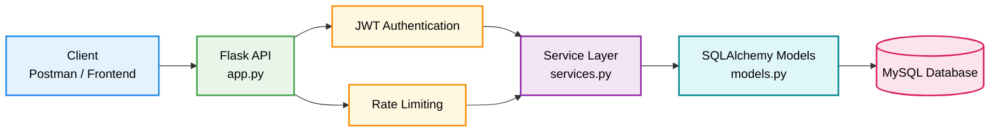

# Flask User Management API

A **production-style RESTful backend API** built with **Flask and MySQL**.  
This project demonstrates real-world backend engineering practices including **JWT authentication, modular architecture, secure password hashing, rate limiting, and database-driven APIs**.


---

# Features

- User registration
- JWT authentication
- Password hashing
- CRUD user management
- Rate limiting for security
- Pagination support
- Modular backend architecture
- Environment variable configuration
- Structured logging

---

# Tech Stack

| Layer | Technology |
|------|-----------|
| Backend | Flask |
| Language | Python |
| Database | MySQL |
| ORM | SQLAlchemy |
| Authentication | Flask-JWT-Extended |
| Security | Werkzeug |
| Rate Limiting | Flask-Limiter |
| Environment Config | python-dotenv |
| API Testing | Postman |
| Version Control | Git & GitHub |

---

# Project Structure

```
flask_user_manager/
│
├── app.py            # Flask application and API routes
├── models.py         # SQLAlchemy database models
├── services.py       # Business logic layer
├── extensions.py     # Flask extensions initialization
├── requirements.txt  # Python dependencies
├── .env.example      # Example environment variables
├── .gitignore        # Git ignored files
└── README.md         # Project documentation
```


### Explanation

| File | Purpose |
|-----|--------|
| `app.py` | Main Flask application and API routes |
| `models.py` | SQLAlchemy database models |
| `services.py` | Business logic and database operations |
| `extensions.py` | Shared Flask extensions |
| `requirements.txt` | Project dependencies |
| `.env.example` | Example environment configuration |

---

# System Architecture

## Backend Architecture Overview

The backend is designed using a **layered architecture** to ensure clear separation of concerns between request handling, security middleware, business logic, and database access.

This design improves:

- maintainability
- scalability
- readability of the codebase
- modular development


