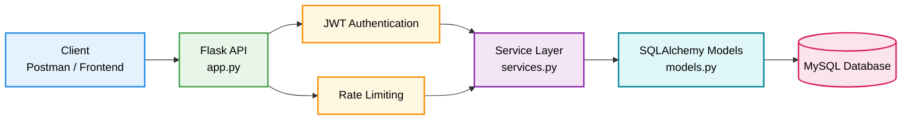

# Flask User Management API

A production-ready RESTful backend API built with **Flask** and **MySQL**. This project demonstrates high-level backend engineering practices including secure JWT authentication, modular architecture, and API security.

---

## 🏗️ System Architecture

## Backend Architecture Overview

The system follows a layered architecture separating request handling, security middleware, business logic, and data access. This improves maintainability, scalability, and overall system design.

The backend is designed using a layered architecture to ensure clear separation of concerns between request handling, security middleware, business logic, and database access.

